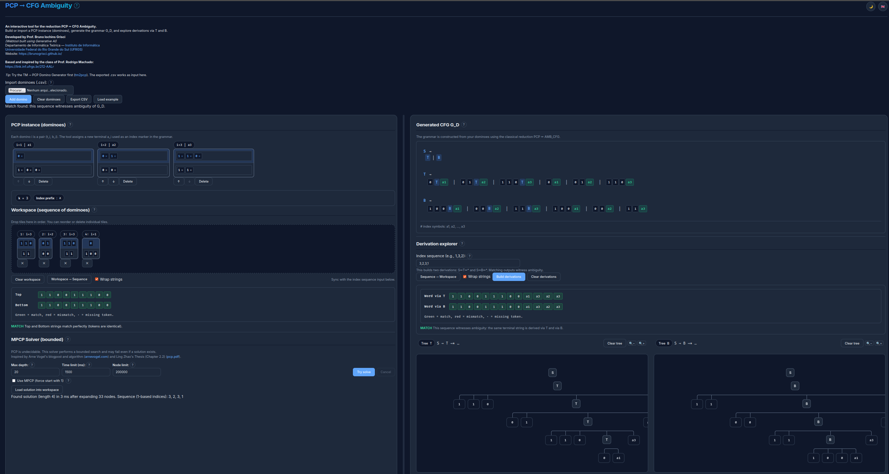

# pcp2cfg-webtool

<p align="right">
  <strong>English</strong> |
  <a href="README.pt-BR.md">Português (Brasil)</a>
</p>


**pcp2cfg-webtool** is an interactive, browser-based educational tool that demonstrates the classical reduction from the **Post Correspondence Problem (PCP)** to **ambiguity of Context-Free Grammars (CFGs)**.

The tool is designed for teaching **Theory of Computation**, letting students *see*, *manipulate*, and *simulate* how a PCP instance is converted into a CFG whose ambiguity witnesses PCP solutions.

🔗 **Live demo:** https://brunogrisci.github.io/pcp2cfg  
🔗 **GitHub repository:** https://github.com/BrunoGrisci/pcp2cfg-webtool



---

## ✨ Features

### Core functionality
- Build a **PCP instance** with draggable dominoes; add, delete, or reorder tiles.
- Import dominoes from a **CSV** (compatible with tm2pcp export) or export the current instance.
- Automatic construction of the **CFG G_D** for the reduction:
  ```
  S -> T | B
  T -> t1 T a1 | ... | tk T ak | t1 a1 | ... | tk ak
  B -> b1 B a1 | ... | bk B ak | b1 a1 | ... | bk ak
  ```
  where each `a_i` is a fresh terminal marking the domino index.
- Interactive **derivation explorer**:
  - Enter an index sequence to build parallel derivations via **T** and **B**.
  - See the generated words (`Word via T` and `Word via B`) with per-token highlighting.
  - Visual, clickable **derivation trees** (expand via grammar rules, zoom controls, clear buttons).
- **Workspace ↔ Sequence** sync:
  - Drag/drop dominoes to form a sequence; copy/paste sequences between the workspace and the index field.
  - Hover highlights show which tokens come from each workspace domino.

---

### MPCP / PCP solver (bounded)

The tool includes a **bounded (M)PCP solver** for exploration.

⚠️ **Important:**  
PCP is **undecidable**. This solver is **not** a decision procedure.

#### How the solver works

- Incremental, prefix-based search that keeps only prefix-consistent sequences.
- Expands sequences up to user-defined limits:
  - **Max depth**
  - **Time limit (ms)**
  - **Node limit**
- Optional **MPCP** toggle: force the sequence to start with domino 1.

The algorithm is inspired by:

- **Ling Zhao**, *Solving the Post Correspondence Problem*, PhD Thesis, Chapter 2.2  
- **Arne Vogel**, PCP solver and blog explanation

#### Solver controls

- **Try solve**: start the bounded search
- **Cancel**: interrupt the search
- **Load solution into workspace**: inspect a found solution

#### Why this does not contradict undecidability

- If the solver finds a solution → it is correct
- If it stops without finding one → no conclusion can be drawn

This behavior is **expected** and illustrates undecidability in practice.

---

### ❓ Integrated help system

Every major part of the interface includes a **“?” help button**, which opens an in-page explanation covering:

- theoretical background (PCP, CFGs, ambiguity, the reduction PCP ⇒ AMB_CFG),
- how to enter/import dominoes and generate the grammar,
- how derivation trees and word alignment work,
- how the bounded solver operates and its limits.

Help content is:

- bilingual (English / Brazilian Portuguese),
- synchronized with dark mode,
- designed to be read independently by students.

---

### Usability & UI
- 🌙 / ☀️ **Dark mode toggle**
- 🇬🇧 / 🇧🇷 **Language toggle** (English & Brazilian Portuguese)
- Persistent preferences via `localStorage`
- Clear status messages and error feedback
- Fully client-side (no backend)

---

## 📄 Input format

### `.csv` domino set
The tool accepts CSV files compatible with tm2pcp exports:

```
domino_id,top_string,bottom_string
```

- `top_string` and `bottom_string` are tokenized by spaces; empty cells are allowed.
- Dominoes are renumbered 1..k on import.
- Avoid using reserved patterns `a1`, `a2`, … inside your own strings; the reduction creates fresh terminals with this prefix.

---

## 🧠 Pedagogical goals

This tool was built to help students:
- Understand the **operational meaning** of reductions
- Visualize how PCP solutions witness **CFG ambiguity**
- Experiment with derivations and trees interactively
- Explore undecidability through bounded search behavior

It is suitable for:
- Undergraduate courses in **Theory of Computation**
- Graduate-level formal languages and computability courses
- Demonstrations, assignments, and interactive lectures

---

## 🌐 Internationalization (i18n)

- Full support for **English** and **Brazilian Portuguese**
- All UI strings, tooltips, and status messages are i18n-enabled
- Language switching does **not** reset the workspace or state

---

## 🛠️ Tech stack

- Vanilla **HTML / CSS / JavaScript**
- No external frameworks
- Fully client-side
- Designed to be hosted via **GitHub Pages**

---

## 🚀 Future work (ideas)

- More preset examples for PCP instances
- Import/export of derivation trees or sequences
- Guided walkthrough mode of the reduction steps
- Additional visual cues for ambiguity witnesses

---
## 🎓 Credits

**Developed by**  
**Prof. Bruno Iochins Grisci**  
Departamento de Informática Teórica  
Instituto de Informática – Universidade Federal do Rio Grande do Sul (UFRGS)  
🔗 https://brunogrisci.github.io/  
🔗 https://www.inf.ufrgs.br/site/  
🔗 https://www.ufrgs.br/site/

**Based on and inspired by**  
Classes by **Prof. Rodrigo Machado**  
📺 https://link.inf.ufrgs.br/212-AALr

**Solver inspiration**:
  - Ling Zhao, *Solving the Post Correspondence Problem*, PhD Thesis, Ch. 2.2
  - Arne Vogel, PCP solver and blog post

**Development note**  
This webtool was created with the assistance of **Generative AI (ChatGPT 5.2)**.

---
## 📦 License

This project is licensed under the **MIT License**.

You are free to use, modify, and redistribute it for academic and educational purposes, provided proper attribution is given.

See the `LICENSE` file for details.

---

If you use this tool in teaching or research, a citation or link back to the repository is greatly appreciated.

## 📚 Citation

If you use this tool in academic work (papers, theses, technical reports, or teaching material), please cite it as:

```bibtex
@software{Grisci_pcp2cfg_webtool,
  author       = {Bruno Iochins Grisci},
  title        = {{pcp2cfg-webtool}: An Interactive Tool for the Reduction PCP to CFG Ambiguity},
  year         = {2026},
  url          = {https://github.com/BrunoGrisci/pcp2cfg-webtool},
  note         = {Educational web-based software},
}
```

---
## 🔄 See also

- **TM → PCP Domino Generator (tm2pcp)**  
  Webtool: https://brunogrisci.github.io/tm2pcp  
  Repository: https://github.com/BrunoGrisci/tm2pcp-webtool  
  tm2pcp builds PCP/MPCP domino sets from Turing Machines (encoding executions as dominoes). The exported `.csv` can be imported directly into pcp2cfg to generate the corresponding CFG and explore ambiguity via derivations and trees.
